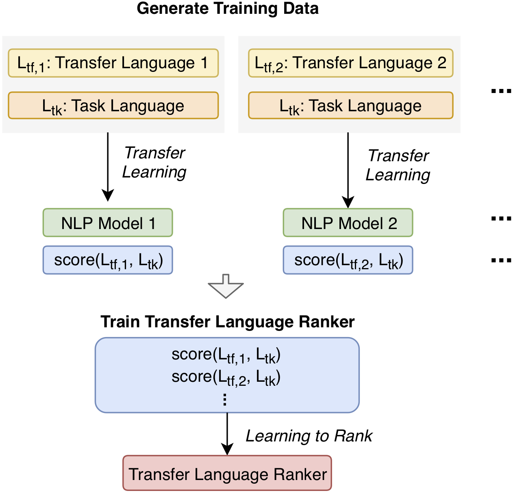

# Using LangRank with URIEL+

By [Mason Shipton](https://github.com/Masonshipton25), [York Hay Ng](https://github.com/Swithord)

## Contents

- [About LangRank](#about-langrank)
- [About URIEL+](#about-uriel)

## About LangRank

### [ProxyLM: Predicting Language Model Performance on Multilingual Tasks via Proxy Models](https://aclanthology.org/P19-1301/)



#### Abstract
Cross-lingual transfer, where a high-resource *transfer* language is used to improve the accuracy of a low-resource *task* language, is now an invaluable tool for improving performance of natural language processing (NLP) on lowresource languages. However, given a particular task language, it is not clear *which* language to transfer from, and the standard strategy is to select languages based on *ad hoc* criteria, usually the intuition of the experimenter. Since a large number of features contribute to the success of cross-lingual transfer (including phylogenetic similarity, typological properties, lexical overlap, or size of available data), even the most enlightened experimenter rarely considers all these factors for the particular task at hand. In this paper, we consider this task of automatically selecting optimal transfer languages as a ranking problem, and build models that consider the aforementioned features to perform this prediction. In experiments on representative NLP tasks, we demonstrate that our model predicts good transfer languages much better than *ad hoc* baselines considering single features in isolation, and glean insights on what features are most informative for each different NLP tasks, which may inform future *ad hoc* selection even without use of our method.

If you are interested for more information, check out the [full paper](https://aclanthology.org/P19-1301/).

<u>If you use this code for your research, please cite the following work:</u>

```bibtex
@article{lin2019choosing,
  title={Choosing transfer languages for cross-lingual learning},
  author={Lin, Yu-Hsiang and Chen, Chian-Yu and Lee, Jean and Li, Zirui and Zhang, Yuyan and Xia, Mengzhou and Rijhwani, Shruti and He, Junxian and Zhang, Zhisong and Ma, Xuezhe and others},
  journal={arXiv preprint arXiv:1905.12688},
  year={2019}
}
```

If you have any questions, you can open a [GitHub Issue](https://github.com/davidanugraha/proxylm/issues) or send them an [email](mailto:david.anugraha@gmail.com).


## About URIEL+

### [URIEL+: Enhancing Linguistic Inclusion and Usability in a Typological and Multilingual Knowledge Base](https://arxiv.org/abs/2409.18472)


#### Abstract
URIEL is a knowledge base offering geographical, phylogenetic, and typological vector representations for 7970 languages. It includes distance measures between these vectors for 4005 languages, which are accessible via the lang2vec tool. Despite being frequently cited, URIEL is limited in terms of linguistic inclusion and overall usability. To tackle these challenges, we introduce URIEL+, an enhanced version of URIEL and lang2vec addressing these limitations. In addition to expanding typological feature coverage for 2898 languages, URIEL+ improves user experience with robust, customizable distance calculations to better suit the needs of the users. These upgrades also offer competitive performance on downstream tasks and provide distances that better align with linguistic distance studies.

If you are interested for more information, check out the [full paper](https://aclanthology.org/2025.coling-main.463/).

<u>If you use this code for your research, please cite the following work:</u>

```bibtex
@article{khan2024urielplus,
  title={URIEL+: Enhancing Linguistic Inclusion and Usability in a Typological and Multilingual Knowledge Base},
  author={Khan, Aditya and Shipton, Mason and Anugraha, David and Duan, Kaiyao and Hoang, Phuong H. and Khiu, Eric and Doğruöz, A. Seza and Lee, En-Shiun Annie},
  journal={arXiv preprint arXiv:2409.18472},
  year={2024}
}
```

If you have any questions, you can open a [GitHub Issue](https://github.com/Masonshipton25/URIELPlus/issues) or send them an [email](mailto:masonshipton25@gmail.com).

Check out ExploRIEL, the online UI for URIEL+: https://uriel-leelab.streamlit.app/ 