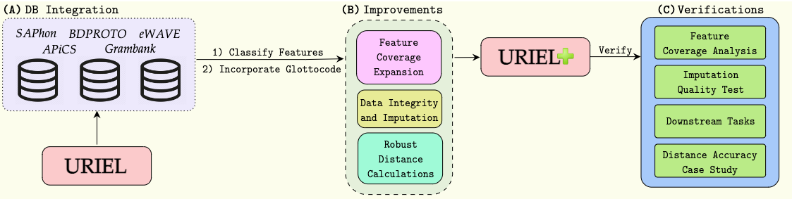

# Using LangRank with URIEL+

By [Mason Shipton](https://github.com/Masonshipton25), [David Duan](https://github.com/davidduan12), [York Hay Ng](https://github.com/Swithord)

## Contents

- [About LangRank](#about-langrank)
- [About URIEL+](#about-uriel)
- [Environment](#environment)
- [Running LangRank Models](#running-langrank-models)
  - [1. Distance Calculation](#1-distance-calculation)
  - [2. Updating Experiment CSVs](#2-updating-experiment-csvs)
  - [3. Running Experiments](#3-running-experiments)
  
  Optional

  - [4. Determining Statistical Significance](#4-determining-statistical-significance)

## About LangRank

### [Choosing Transfer Languages for Cross-Lingual Learning](https://aclanthology.org/P19-1301/)


#### Abstract
Cross-lingual transfer, where a high-resource *transfer* language is used to improve the accuracy of a low-resource *task* language, is now an invaluable tool for improving performance of natural language processing (NLP) on lowresource languages. However, given a particular task language, it is not clear *which* language to transfer from, and the standard strategy is to select languages based on *ad hoc* criteria, usually the intuition of the experimenter. Since a large number of features contribute to the success of cross-lingual transfer (including phylogenetic similarity, typological properties, lexical overlap, or size of available data), even the most enlightened experimenter rarely considers all these factors for the particular task at hand. In this paper, we consider this task of automatically selecting optimal transfer languages as a ranking problem, and build models that consider the aforementioned features to perform this prediction. In experiments on representative NLP tasks, we demonstrate that our model predicts good transfer languages much better than *ad hoc* baselines considering single features in isolation, and glean insights on what features are most informative for each different NLP tasks, which may inform future *ad hoc* selection even without use of our method.

If you are interested for more information, check out the [full paper](https://aclanthology.org/P19-1301/).

<u>If you use this code for your research, please cite the following work:</u>

```bibtex
@inproceedings{lin-etal-2019-choosing,
    title = "Choosing Transfer Languages for Cross-Lingual Learning",
    author = "Lin, Yu-Hsiang  and
      Chen, Chian-Yu  and
      Lee, Jean  and
      Li, Zirui  and
      Zhang, Yuyan  and
      Xia, Mengzhou  and
      Rijhwani, Shruti  and
      He, Junxian  and
      Zhang, Zhisong  and
      Ma, Xuezhe  and
      Anastasopoulos, Antonios  and
      Littell, Patrick  and
      Neubig, Graham",
    editor = "Korhonen, Anna  and
      Traum, David  and
      M{\`a}rquez, Llu{\'i}s",
    booktitle = "Proceedings of the 57th Annual Meeting of the Association for Computational Linguistics",
    month = jul,
    year = "2019",
    address = "Florence, Italy",
    publisher = "Association for Computational Linguistics",
    url = "https://aclanthology.org/P19-1301/",
    doi = "10.18653/v1/P19-1301",
    pages = "3125--3135",
    abstract = "Cross-lingual transfer, where a high-resource transfer language is used to improve the accuracy of a low-resource task language, is now an invaluable tool for improving performance of natural language processing (NLP) on low-resource languages. However, given a particular task language, it is not clear which language to transfer from, and the standard strategy is to select languages based on ad hoc criteria, usually the intuition of the experimenter. Since a large number of features contribute to the success of cross-lingual transfer (including phylogenetic similarity, typological properties, lexical overlap, or size of available data), even the most enlightened experimenter rarely considers all these factors for the particular task at hand. In this paper, we consider this task of automatically selecting optimal transfer languages as a ranking problem, and build models that consider the aforementioned features to perform this prediction. In experiments on representative NLP tasks, we demonstrate that our model predicts good transfer languages much better than ad hoc baselines considering single features in isolation, and glean insights on what features are most informative for each different NLP tasks, which may inform future ad hoc selection even without use of our method."
}
```

If you have any questions, you can open a [GitHub Issue](https://github.com/neulab/langrank/issues).


## About URIEL+

### [URIEL+: Enhancing Linguistic Inclusion and Usability in a Typological and Multilingual Knowledge Base](https://aclanthology.org/2025.coling-main.463/)



#### Abstract
URIEL is a knowledge base offering geographical, phylogenetic, and typological vector representations for 7970 languages. It includes distance measures between these vectors for 4005 languages, which are accessible via the lang2vec tool. Despite being frequently cited, URIEL is limited in terms of linguistic inclusion and overall usability. To tackle these challenges, we introduce URIEL+, an enhanced version of URIEL and lang2vec addressing these limitations. In addition to expanding typological feature coverage for 2898 languages, URIEL+ improves user experience with robust, customizable distance calculations to better suit the needs of the users. These upgrades also offer competitive performance on downstream tasks and provide distances that better align with linguistic distance studies.

If you are interested for more information, check out the [full paper](https://aclanthology.org/2025.coling-main.463/).

<u>If you use this code for your research, please cite the following work:</u>

```bibtex
@inproceedings{khan-etal-2025-uriel,
    title = "{URIEL}+: Enhancing Linguistic Inclusion and Usability in a Typological and Multilingual Knowledge Base",
    author = {Khan, Aditya  and
      Shipton, Mason  and
      Anugraha, David  and
      Duan, Kaiyao  and
      Hoang, Phuong H.  and
      Khiu, Eric  and
      Do{\u{g}}ru{\"o}z, A. Seza  and
      Lee, En-Shiun Annie},
    editor = "Rambow, Owen  and
      Wanner, Leo  and
      Apidianaki, Marianna  and
      Al-Khalifa, Hend  and
      Eugenio, Barbara Di  and
      Schockaert, Steven",
    booktitle = "Proceedings of the 31st International Conference on Computational Linguistics",
    month = jan,
    year = "2025",
    address = "Abu Dhabi, UAE",
    publisher = "Association for Computational Linguistics",
    url = "https://aclanthology.org/2025.coling-main.463/",
    pages = "6937--6952",
    abstract = "URIEL is a knowledge base offering geographical, phylogenetic, and typological vector representations for 7970 languages. It includes distance measures between these vectors for 4005 languages, which are accessible via the lang2vec tool. Despite being frequently cited, URIEL is limited in terms of linguistic inclusion and overall usability. To tackle these challenges, we introduce URIEL+, an enhanced version of URIEL and lang2vec that addresses these limitations. In addition to expanding typological feature coverage for 2898 languages, URIEL+ improves the user experience with robust, customizable distance calculations to better suit the needs of users. These upgrades also offer competitive performance on downstream tasks and provide distances that better align with linguistic distance studies."
}
```

If you have any questions, you can open a [GitHub Issue](https://github.com/Lee-Language-Lab/URIELPlus/issues) or send them an [email](mailto:masonshipton25@gmail.com).

Check out ExploRIEL, the online UI for URIEL+: https://uriel-leelab.streamlit.app/ 


## Environment

Requires **Python 3.10** or later.

All dependencies are listed in the `requirements/` folder.


## Running LangRank Models

### 1. Distance Calculation

Run the following script to calculate URIEL+ distances:

```bash
python distances/calculate_distances.py
```

This will create four CSV files containing distances for the **DEP**, **EL**, **MT**, and **POS** language datasets.

> Output files will be saved to the `distances/` folder.

---


### 2. Updating Experiment CSVs

After calculating distances, run:

```bash
python distances/replace_distances.py
```

This updates the experiment CSV files for DEP, EL, MT, and POS with URIEL+ distances.

> Updated experiment CSVs will be saved to `src/csv_datasets/`.

---

### 3. Running Experiments

<details>
<summary><strong>Dependency Parsing (DEP) Experiments</strong> (click to expand)</summary>

- **LangRank (all)**
  ```bash
  python src/langrank_models/dep.py --mode all
  ```

- **LangRank (lang feats)**
  ```bash
  python src/langrank_models/dep.py --mode lang
  ```

</details>

---

<details>
<summary><strong>Entity Linking (EL) Experiments</strong> (click to expand)</summary>

- **LangRank (all)**
  ```bash
  python src/langrank_models/el.py --mode all
  ```

- **LangRank (lang feats)**
  ```bash
  python src/langrank_models/el.py --mode lang
  ```

</details>

---

<details>
<summary><strong>Machine Translation (MT) Experiments</strong> (click to expand)</summary>

- **LangRank (all)**
  ```bash
  python src/langrank_models/mt.py --mode all
  ```

- **LangRank (lang feats)**
  ```bash
  python src/langrank_models/mt.py --mode lang
  ```

</details>

---

<details>
<summary><strong>Part of Speech (POS) Tagging Experiments</strong> (click to expand)</summary>

- **LangRank (all)**
  ```bash
  python src/langrank_models/pos.py --mode all
  ```

- **LangRank (lang feats)**
  ```bash
  python src/langrank_models/pos.py --mode lang
  ```

</details>

---

### Optional

### 4. Determining Statistical Significance

You can test statistical significance between URIEL, URIEL+, or different URIEL versions.

**Steps:**

1. `NDCG@3 scores` from the experiment are outputted to the terminal.  
   Copy the scores into `statistical.py` under the correct experiment section.

2. Run:
   ```bash
   python statistical.py
   ```
   > This will output the **p-value** measuring the statistical significance between the different URIEL results.
